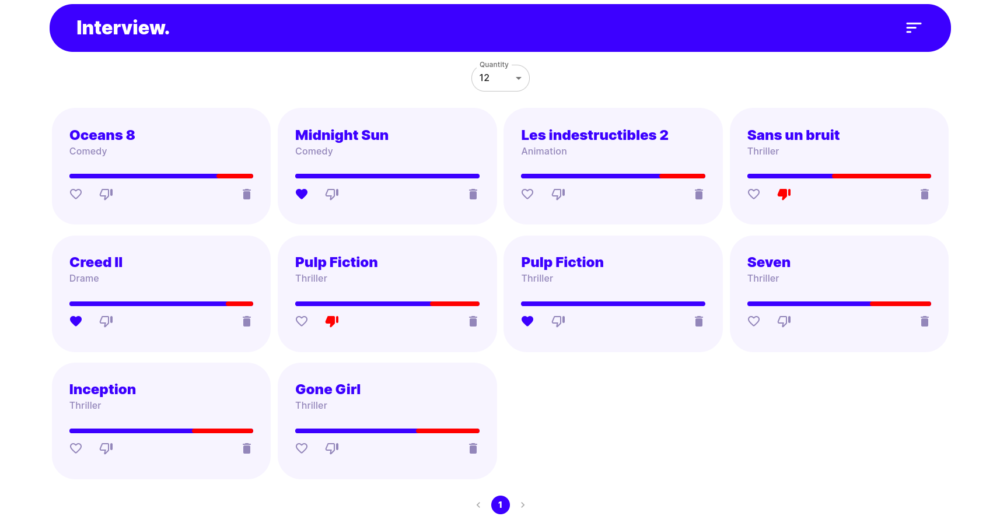

<center>
    
</center>

## Available Scripts

In the project directory, you can run:

Docker production mode:
```bash
sudo docker compose up --build
```
npm production mode:
```bash
npm install
npm run build
npm install -g serve
serve -s build
```
npm development mode:
```bash
npm install
npm start
```
